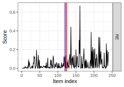

# carelessonset 

Implementation of the working paper ["I Don't Care Anymore: Identifying the Onset of Careless Responding"](https://arxiv.org/abs/2303.07167) by Max Welz and Andreas Alfons. This paper proposes a method to identify the onset of careless responding (or an absence thereof) in lengthy questionnaires on the participant-level. 

Our goal is to expand the code into an R package. For now, the repository is organized as follows. The folder `R` contains two subfolders:

- `autoencoder` contains code for the autoencoder as well as the longstring sequences,
- `changepoints` contains code for the chanegpoint identification (main file: `changepoints.R`).

**We emphasize that this implementation has not yet been thoroughly tested, so we cannot yet guarantee correctness or stability!**

## Dependencies
You need to have the following `C++` installations:
- `C++17` and a `C++` compiler,
- The `eigen3` library (http://eigen.tuxfamily.org/index.php?title=Main_Page#Download),
- CRAN packages `Rcpp` and `Rcpp`; installable via the `R` command `install.packages(c("Rcpp", "RcppEigen"))`.

In addition, the code requires an installation of the Python libraries [TensorFlow](https://www.tensorflow.org/install) and [Keras](https://keras.io/), as well as an installation of [Python](https://www.python.org/downloads/) itself and required dependencies. All components can easily be installed by running the `R` script below. *Important*: If you are using RStudio, we recommend to change the Python settings for RStudio as follows before installation, as the default settings may cause issues. Specifically, in RStudio, go to Global Settings -> Python -> uncheck "Automatically activate project-local Python environments".

```R
## download R interface for keras
install.packages("keras") # install keras

## Note: you may be asked to install Miniconda if there is no Python installation on your machine. Agree to this.

## install keras
keras::install_keras(method = "auto", conda = "auto", version = "2.9")  
```

In case of questions, please get in touch with Max Welz (`welz <at> ese <dot> eur <dot> nl`).


## Example
In the below example, we simulate 500 responses to 240 items that measure 30 constructs (8 items per construct). One respondent starts responsing randomly from the 120th item onward. For illustrative purposes, the design is kept simple. For instance, there are no reverse-coded items, the respondents are likely to agree to all items, and we do not simulate response times.

```R
# load functions (may lead to some compiler noise)
source("R/load.R")

# set seed
set.seed(328635491)

# for data generation
# install.packages("simstudy")
library("simstudy")

## get positive definite correlation matrix
# to keep things simple, assume that there are 30 constructs measured
# with  8 items each, and the within-construct correlation is 0.7,
# and the between-construct correlation is 0
construct_size <- 8
num_scales <- 30

num_items <- num_scales * construct_size
Rho <- matrix(0.0, nrow = num_items, ncol = num_items)

# obtain a block matrix with the desired correlation structure
for(i in seq(from=0, to=num_scales-1)){
  
  interval <- seq_len(construct_size) + i * construct_size
  Rho[interval, interval] <- 0.6
  
} # FOR

# to be valid correlation matrix, diagonal elements must be one
diag(Rho) <- 1.0 


## probabilities to choose answer category
# let there be 5 answer categories and assume that participants are likely to agree
# to all items (no reverse coding to keep things simple)
probabilities <- c(0.1, 0.15, 0.2, 0.25, 0.3)
baseprobs     <- matrix(probabilities, nrow = num_items, ncol = 5L, byrow = TRUE)


## generate responses of n = 500 participants with the desired correlation structure
n <- 500
temp <- simstudy::genData(n)
data <- simstudy::genOrdCat(temp,
                            baseprobs = baseprobs,
                            prefix = "q",
                            corMatrix = Rho)

data <- as.matrix(data[,-1]) # drop id
data <- matrix(as.integer(data), nrow = n)

## assume that there is one single careless respondent (id=100)
## who starts responding randomly from the 120-th item onward
onset_true <- 120
data[100, onset_true:num_items] <-
  sample(1:5, size = num_items - onset_true + 1, replace = TRUE)


## run main functionality (there may be some compiler noise)
x <- carelessonset(responses = data, 
                   num_scales = num_scales, 
                   num_likert = 5,     # 5 answer categories
                   longstring = FALSE, # don't consider longstring-indices here
                   seed = 206223) 

## get participants in which carelessness is flagged at level 0.1%
# only participant 100 (the contaminated one!) is flagged
# location of estimated onset is 114, which is close to true onset (120)
get_onset(x, alpha = 0.001)
#      idx flagged onset
# [1,]         100   114

## make plot of reconstruction errors: red line is estimated onset
p <- plot.carelessonset(x, idx = 100, alpha = 0.001)

## add blue line for true onset
(p <- p + geom_vline(xintercept = onset_true, col = "blue", size = 0.7))

```

# 

As we can see in the picture, true carelessness (blue line) is accurately estimated (red line).

